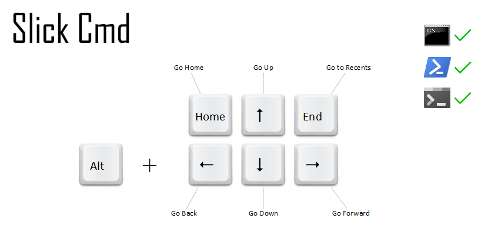
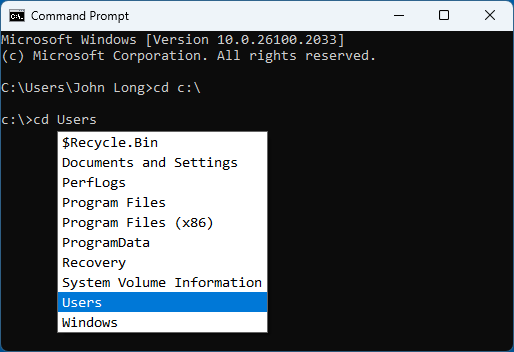
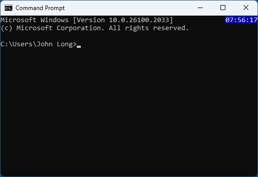
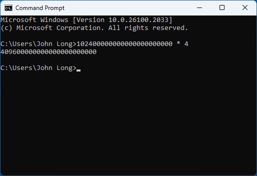

[](https://github.com/johnlng/slickcmd/actions)





**Slick Cmd** is a lightweight utility designed to supercharge your Windows Command Prompt experience by making directory navigation, path completion, and command management more efficient. Slick Cmd runs quietly in your system tray, enabling you to access its powerful features through intuitive keyboard shortcuts.

## Screenshots



*cd completion*

------



*console clock*

------



*direct calculation*

------


## ✨ Features

- **Streamlined Directory Navigation:**
    - `Alt + Up` — Move to the parent directory.
    - `Alt + Down` — Display a popup with a list of subdirectories for quick access.
    - `Alt + Left` — Navigate backward to the previous directory.
    - `Alt + Right` — Navigate forward to the next directory.
    - `Alt + Home` — Jump to the home directory.
    - `Alt + End` — View and navigate to recent directories.

- **Smart Path Completion:**
    - While typing a `cd` command, a path completion list appears, helping you quickly select from available directories.
    - `Esc` — Close the path completion list.
    - `Tab` — Accept the selected path without executing `cd`.
    - `Enter` — Accept the selected path and `cd` into it immediately.

- **Command History Management:**
    - `Alt + F7` — Open the command history dialog to select from previously used commands.
    - `Enter` — Place the selected command in the command line for review or modification.
    - `Ctrl + Enter` — Execute the selected command immediately.
    - Command history persists across sessions, so you can always refer back to previous commands.

- **Auto-Correct for `cd`:**
    - Automatically adds the `/d` flag when switching to a directory on another drive, eliminating the need to remember it manually.

- **Quick Screen Clearing:**
    - `Ctrl + L` — Clear the screen with a single keystroke, running the `cls` command automatically.

- **Console clock**
    - Remember the good old DOS TSR clock? This feature brings it back to life in today's console window.
    - >This is an optional feature. To enable it, check the options dialog.

- **Command line calculator**
    - Perform calculations directly in the classic command prompt, just like in PowerShell.
    - >This is an optional feature. To enable it, check the options dialog.

- **Minimize to tray**
    - Minimize the console window to the system tray by holding the Alt key while clicking the minimize button.

## ⚙️ Requirements

* **Operating System:** Windows 10 or above, 64-bit
* **Shell Compatibility:** Classic Command Prompt(cmd.exe) or PowerShell(powershell.exe or pwsh.exe)

## 📖 Installation

> [!NOTE]
> Before installation, please exit SlickCmd and close all running Command Prompts 
> to allow the application binaries to be overwritten.

### Install from GitHub Release

1. **Download:** Get the latest version of Slick Cmd from the [Releases page](https://github.com/johnlng/slickcmd/releases).
2. **Install:** Extract the release zip to a preferred installation folder on your local filesystem.
3. **Launch:** Start Slick Cmd by double-clicking `slickcmd.exe`. A small icon will appear in your system tray, indicating it’s running.

### Install with WinGet 
I've submitted SlickCmd to the [Windows Package Manager Community Repository](https://github.com/microsoft/winget-pkgs)
and it has passed validation. You can install SlickCmd using winget with the following command: 
```
winget install "Slick Cmd"
```
After installation, you may encounter issues starting SlickCmd from the command line directly 
due to the Windows SmartScreen Filter, which can silently block unrecognized apps.
To launch SlickCmd, follow these steps:
1. Open Windows Explorer.
2. Navigate to the following directory:
```C:\Users\Your User Name\AppData\Local\Microsoft\WinGet\Links```
3. Click on `slickcmd.exe` to run the application.

Unfortunately, this means the winget installation is less convenient at this time.


### 🛠️ Install from source
```
git clone https://github.com/johnlng/slickcmd.git
cd slickcmd
cargo build
```
You can find the binaries in the target folder.

## Verification
After starting SlickCmd, Open a command prompt window and press `Alt + Up` 
to see if you can navigate to the parent directory. 
if you can, things should be working fine.  

Note that "a command prompt window" can refer to any of the following:

* A classic windows command prompt window (`cmd.exe`), 
* A Windows PowerShell window (`powershell.exe`)
* A PowerShell 7+ window (`pwsh.exe`), 
* A Windows Terminal window running any of the above shells.

## 📜 License

Slick Cmd is distributed under the [MIT License](https://github.com/johnlng/slickcmd?tab=MIT-1-ov-file).

## 💡 Contribute & Support

I’d love to hear your thoughts! If you have suggestions, feature requests, or find bugs, please [open an issue on the GitHub repository](https://github.com/johnlng/slickcmd/issues).

If you like the project, please consider giving it a ⭐ and sharing it with others to show your support!


## Acknowledgments

* The keyboard button image used in this project is sourced from [AutoHotKey](https://github.com/AutoHotkey/AutoHotkey)
* The calculator implementation is adapted from [posixutils-rs](https://github.com/rustcoreutils/posixutils-rs) 
